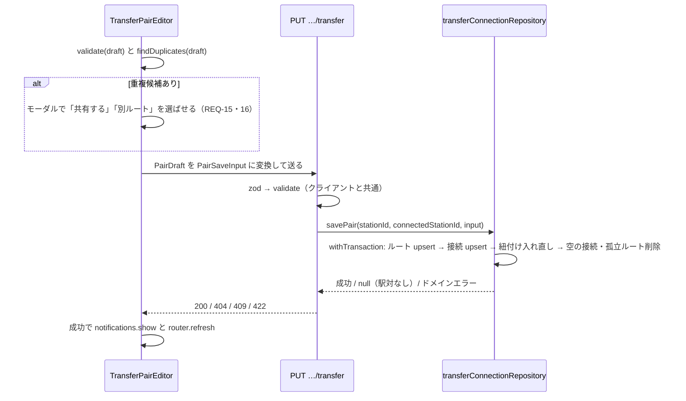

# 設計: 乗換難易度 Admin 入力フォームの対応 (Issue #124)

## 参照

[requirements.md](./requirements.md) / [tasks.md](./tasks.md) /
[docs/domain/station-master-model.md](../domain/station-master-model.md)「乗換難易度」節（4層構造・不変条件）/
[ADR-0001](../adr/0001-layer-structure.md)（層と依存）/ [ADR-0002](../adr/0002-dependency-inversion-ports.md)（ports）/
[ADR-0003](../adr/0003-read-write-separation.md)（Query と Repository）/
[ADR-0005](../adr/0005-write-atomicity-driver.md)（`withTransaction`）/
[ADR-0011](../adr/0011-transfer-route-facilities-as-set.md)（設備は集合）/
[ADR-0012](../adr/0012-zero-facility-route-as-not-entered.md)（設備0件は未入力）

本Issueは Admin の**入力**を新モデルに切り替える。スキーマとデータは #122・#123 で入っていて変更しない。
ドメイン定義（4層構造・不変条件）は恒久知識として `docs/domain/` にある。本書には
**この作業限りの判断**と、画面・API・Repository の設計だけを置く。

## アーキテクチャ

```
app/stations/[stationId]/connections/[connectedStationId]/transfer/page.tsx   (Server Component)
   └─ transferPairEditPageQuery.getContext(stationId, connectedStationId)      … 読み取り（ADR-0003）
        └─ TransferPairEditor (Client)  … 下書き（draft）を useState で持つ
             ├─ RouteCard × N          … 設備チェック・フラグ・方面2×2・プレビュー
             ├─ DuplicateRouteModal    … 保存時の重複候補（提示のみ）
             └─ 保存 → PUT /api/stations/[stationId]/connections/[connectedStationId]/transfer
                        └─ validate（クライアントと共通の純粋関数）→ transferConnectionRepository.savePair()
                             └─ withTransaction（ADR-0005）

features/transfer-connection/        ports.ts / schema.ts / domain/{draft,validate,duplicates}.ts / components/
external/query/transferPairEditPageQuery.ts
external/repository/transferConnectionRepository.ts
packages/transfer-difficulty/        requirementFor・isBarrierFree（純粋関数。Admin のプレビューと #125 の Web が使う）
```

- `features/transfer-connection/domain/` は Next・DB に依存しない純粋関数（ADR-0001）。`app/` にはロジックを書かない。
- Query と Repository の実装は `external/` に置き、`di.ts` で配線する（ADR-0002）。usecases 層は作らない
  （前例の station-publishing と同じく、ルートが Repository を直接呼ぶ）。
- `packages/transfer-difficulty` は `packages/platform-diagram` と同じく、DB・Next 非依存（ESLint で禁止）。
  ADR-0010 の前例に従うだけで、新しい決定ではない。

## 編集モデル

### 方面の組み合わせ（ComboKey）

駅対は S・T の各端点が `inbound` / `outbound` の2値を取るので、組み合わせは4通り。
`ComboKey = 'inbound:inbound' | 'inbound:outbound' | 'outbound:inbound' | 'outbound:outbound'`
（`${S の方面}:${T の方面}`）。DB の `transfer_connections` は端点を昇順に正規化して持つため、
**読み込みと保存のときに S/T の向きと A/B の向きを変換する**（変換は `domain/draft.ts` に閉じ、テストする）。

### 下書き（クライアント状態）

```ts
type RouteDraft = {
  key: string;                    // カードの安定キー（crypto.randomUUID）
  routeId: string | null;         // null = 新規ルート
  label: string;
  isBaseline: boolean;
  minutes: number | null;
  isOutdoor: boolean; requiresExitGate: boolean; requiresStaff: boolean; isOfficiallyGuided: boolean;
  notes: string;
  facilities: FacilityTypeCode[]; // 集合。重複なし
  combos: ComboKey[];             // 適用先
};
type PairDraft = {
  routes: RouteDraft[];
  connectionNotes: Record<ComboKey, string>;  // ルートが適用されている組み合わせだけ保存する
};
```

- `label` と `isBaseline` は本来 `connection_routes`（接続×ルート）の属性だが、**1つの駅対の中では、同じルートの
  すべての紐付けに同じ値を書く**（決定4）。1枚のカードが持つ値は1つで足りる。
- 読み込み時、既存データで同じルートの `label` / `isBaseline` が組み合わせごとに違う場合は、最初の組み合わせの値を
  採り、カードに「紐付けごとに値が異なっていた。保存すると揃う」と警告する（#123 の移行データでは発生しない）。

### 画面の要素

| 要素 | 内容 |
|---|---|
| ルートカード | label / 基準ルートのスイッチ / 所要時分 / 4フラグ / 設備の7種チェック / 備考 / 適用先 2×2 / 複製・削除 / プレビュー |
| 適用先 2×2 | 行を S の方面、列を T の方面とし、`line_directions.displayName` を補助表示する（同義行は「／」で連結。#130 まで解決規則は無い） |
| 共有バッジ | 「共有中: ○○」＋「この駅対だけ切り離す」（REQ-18・19） |
| 接続の備考 | 既定は全方面で1欄。組み合わせごとに値が異なるときは組み合わせごとの欄（REQ-10） |
| 入力ガイド | 代替手段は別ルート／段差無しは `sameFloor`／備考に「〇〇のほうが便利」を書かない（REQ-7・27） |
| 警告 | 代替手段の同居・基準ルート無し・紐付けごとに値が異なっていた（保存は止めない） |
| プレビュー | ベビーカー・車いすの必要な行為と、バリアフリールートか。設備0件は「設備が未入力」 |

### 操作（`domain/draft.ts` の純粋関数）

`addRoute` / `duplicateRoute`（`routeId = null`・`combos = []`）/ `removeRoute` / `updateRoute` /
`toggleCombo` / `toggleFacility` / `detachFromSharedRoute`（`routeId = null` にする）/
`mergeIntoCandidate`（`routeId` を一致先に付け替える）/ `mergeCards`（2枚を統合。combos は和集合）。
いずれもイミュータブルで、`editDraft.ts`（station-layout）と同じ形にする。

## データフロー

### 読み込み（`transferPairEditPageQuery.getContext`）

`station_connections` に S→T が無ければ `null`（404）。あれば次を返す。

```ts
type TransferPairEditContext = {
  stationId: string; connectedStationId: string;
  stationName: string; connectedStationName: string;
  lineName: string | null; connectedLineName: string | null;
  directionHints: { station: Record<DirectionType, string[]>; connected: Record<DirectionType, string[]> };
  facilityTypes: { code: FacilityTypeCode; name: string }[];   // facility_types（7行）
  connections: { combo: ComboKey; connectionId: string; notes: string | null; source: StationConnectionSource | null }[];
  routes: PairRouteRecord[];        // この駅対の接続に結ばれたルート
  candidates: CandidateRoute[];     // S か T を端点に持つ接続のルートで、この駅対に結ばれていないもの
};
type PairRouteRecord = {
  routeId: string; minutes: number | null; isOutdoor: boolean; requiresExitGate: boolean;
  requiresStaff: boolean; isOfficiallyGuided: boolean; notes: string | null; facilities: FacilityTypeCode[];
  links: { combo: ComboKey; label: string; isBaseline: boolean }[];
  sharedWith: { stationName: string; connectedStationName: string }[];   // 駅対の外の接続からの参照
};
type CandidateRoute = {
  routeId: string; label: string; minutes: number | null; flags…; facilities: FacilityTypeCode[];
  usedBy: string;    // 「池袋（丸ノ内線）↔ 池袋（副都心線）」のような表示用の文字列
};
```

- 端点が `{S, T}` のどちらか一方でも一致する接続を、端点の両順序（A,B）と（B,A）で引く（domain の読み取り規約）。
- DTO は JSON で運べる素のデータにする（ADR-0003）。導出結果（必要な行為）は含めず、画面が `packages/transfer-difficulty` で導出する。
- `directionHints` は `stationLines` → `lines` → `line_directions`（`lineId`, `directionType`）の `displayName` 一覧。
  路線を持たない駅は空配列。

### 保存



#### `savePair` の手順（1トランザクション）

1. `station_connections` に S→T があるか確認する。無ければ `null` を返す（404）。
2. この駅対の既存の接続（端点の両順序）と、その `connection_routes`、参照しているルート ID を読む。
3. 入力の `routeId`（非 null）が「この駅対に結ばれている」または「候補の範囲（S か T を端点に持つ接続のルート）」に
   あることを確認する。外れていれば `RouteOutOfScopeError`（422）。
4. ルートを書く。新規は INSERT、既存は UPDATE（`minutes`・4フラグ・`notes`）し、設備は delete → insert で入れ替える。
5. ルートが1本以上ある組み合わせの接続を upsert する（`unique_transfer_connection` を衝突対象に。端点は
   `normalizeTransferEndpoints()` で正規化）。新規は `source = 'manual'`、既存の `source` は保つ。`notes` は更新する。
6. この駅対の接続の `connection_routes` を**全部削除してから入れ直す**（label・isBaseline は入力どおり）。
   先に全部消すので、基準ルートの付け替えで `unique_connection_baseline` に違反しない。
7. 紐付けが0件になった接続を削除する（ルートが0本になった組み合わせ）。
8. この保存で紐付けから外れたルートのうち、どの接続からも参照されなくなったものを削除する。設備は cascade で消える。

- 端点の変換: S の方面と T の方面から `TransferEndpoint` を2つ作り、`normalizeTransferEndpoints()` に通して A/B に割り当てる。
- `unique_connection_route_label` の違反（23505）は `RouteLabelTakenError`（409）に変換する。`isPgErrorCode`（`external/pgError.ts`）を使う
  （`withTransaction` の中では `err.cause.code` にも入る）。他の制約違反は想定外として 500。
- ポート型（`ports.ts`）: `TransferConnectionRepository { savePair(...): Promise<{ ok: true } | null> }` と
  ドメインエラー `RouteOutOfScopeError` / `RouteLabelTakenError` / `TransferInputInvalidError`。

#### 駅対の削除（`stationConnectionRepository.deletePair` の拡張）

`withTransaction` にして、次を1トランザクションで行う（REQ-25）。
`station_connections` の2行を削除 → その駅対の `transfer_connections` を削除（`connection_routes` は cascade）→
孤立ルートを削除。孤立ルートの削除は `savePair` と同じ内部関数を共有する。

## インターフェース

### API

| メソッド | パス | 本文 | 応答 |
|---|---|---|---|
| PUT | `/api/stations/[stationId]/connections/[connectedStationId]/transfer` | `PairSaveInput` | 200 `{ success: true }`（既存の API と同じ形）/ 400（JSON 不正・zod）/ 404（駅対なし・id が UUID でない）/ 409（label 重複）/ 422（検証違反の配列 `{ error: ValidationIssue[] }`・範囲外の `routeId`）/ 500 |

```ts
type PairSaveInput = {
  routes: {
    routeId: string | null; label: string; isBaseline: boolean; minutes: number | null;
    isOutdoor: boolean; requiresExitGate: boolean; requiresStaff: boolean; isOfficiallyGuided: boolean;
    notes: string | null; facilities: FacilityTypeCode[]; combos: ComboKey[];
  }[];
  connectionNotes: Partial<Record<ComboKey, string | null>>;
};
```

### `packages/transfer-difficulty`

```ts
export const FACILITY_TYPE_CODES = ['sameFloor','elevator','ramp','wheelchairEscalator','escalator','stairLift','stairs'] as const;
export type FacilityTypeCode = typeof FACILITY_TYPE_CODES[number];
export type Persona = 'stroller' | 'wheelchair';
export type Requirement = 'as_is' | 'call_staff' | 'fold_and_carry' | 'lift' | 'assisted_by_staff' | 'impossible';

// 設備の集合から、そのペルソナにとって最も重い行為を返す。空集合は null（設備未入力。ADR-0012）
export function requirementFor(persona: Persona, facilities: readonly FacilityTypeCode[]): Requirement | null;
export function isBarrierFree(requirement: Requirement | null): boolean;   // as_is または call_staff。null は false
export const REQUIREMENT_LABEL: Record<Requirement, string>;
export const PERSONA_LABEL: Record<Persona, string>;
```

導出表（#30 REQ-13。旧版の `docs/spec` は git 履歴にある）:

| 設備 | ベビーカー | 車いす |
|---|---|---|
| `sameFloor` / `elevator` / `ramp` | `as_is` | `as_is` |
| `wheelchairEscalator` | `fold_and_carry` | `call_staff` |
| `escalator` | `fold_and_carry` | `impossible` |
| `stairLift` | `impossible` | `call_staff` |
| `stairs` | `lift` | `assisted_by_staff` |

重さの順序 — ベビーカー: `as_is` ＜ `fold_and_carry` ＜ `lift` ＜ `impossible` /
車いす: `as_is` ＜ `call_staff` ＜ `assisted_by_staff` ＜ `impossible`。

- `FACILITY_TYPE_CODES` は DB の `facility_types` の7行と一致すること。DB とパッケージの一致は自動テストでは守れない
  （CI に DB が無い）ため、手動検証で Neon の `facility_types` と突き合わせる。

## エラーマトリックス

| 状況 | 結果 | 備考 |
|---|---|---|
| 駅対（`station_connections` の S→T）が無い | ページは `notFound()`、保存は 404 | REQ-2 |
| JSON が不正 / zod に合わない | 400（`{ error: issues }`） | 設備コードが7種以外もここ |
| ルートに組み合わせが無い・label 重複・基準ルート2本・`label` が空 | 422 | `validate` がクライアントと共通 |
| `routeId` が範囲外 | 422 `RouteOutOfScopeError` | 無関係な接続のルートの書き換えを防ぐ |
| `unique_connection_route_label` 違反（競合で発生） | 409「同じ名前のルートがあります」 | REQ-28 |
| 想定外の DB エラー | 500（トランザクションは全体がロールバック） | |
| 2人が同時に同じ駅対を保存した | **後勝ち**（検出しない） | 管理者は開発者1名の前提。競合検出は対象外 |
| 保存済みの共有ルートを編集した | 共有先にも反映（バッジで明示） | REQ-18 |
| 重複候補があるが「別ルート」を選んだ | そのまま保存する | 決定2 |

## ユニットテスト戦略

CI に DB が無いため（#122・#123 と同じ）、DB を使う部分は手動検証で担保する。次を自動テストにする。

| 対象 | 内容 |
|---|---|
| `packages/transfer-difficulty` | 7設備×2ペルソナの導出表、「最も重い行為」（混在）、空集合が `null`、`isBarrierFree` |
| `domain/draft.ts` | コンテキスト→下書き（淡路町型: 組み合わせが2つのカードに分かれる／御茶ノ水型: 共有の `sharedWith`）、下書き→入力、S/T ⇔ A/B の変換、複製・切り離し・統合 |
| `domain/validate.ts` | REQ-11 の各違反、組み合わせ単位の判定、警告（基準ルート無し・代替手段の同居） |
| `domain/duplicates.ts` | 設備0件は対象外、自分自身は除外、変更が無い既存ルートは検出しない、候補外は出ない、同じ画面のカードとの一致 |
| `schema.ts`（zod） | 必須・上限・設備コードの列挙 |
| `route.test.ts` | 200・400・404・409・422（`@/di` をモックし、ハンドラを直接呼ぶ。前例: publication の route.test.ts） |
| コンポーネント | `RouteCard`（設備の切替・プレビュー表示・0件は「未入力」）、`DuplicateRouteModal` |

DB 検証は手動: development で保存し、Neon MCP（read-only）の SELECT で不変条件を確かめる（tasks.md TASK-13）。

## 決定記録（この作業限りの判断）

いずれも既存 ADR に反せず、覆すときに明示的な意思決定を要するアーキテクチャ決定ではないため、ADR にしない
（ただし決定2はフェーズ5で ADR の要否を再確認する）。

### 決定1 — 編集の単位は「駅対」。1画面で方面の4通りをまとめて編集する

**決定**: 接続（駅×方面の端点対）ごとの画面ではなく、駅対（S・T）ごとの1画面で、4通りの組み合わせの接続を編集する。
ルートカードに「適用先の方面 2×2」を持たせ、全方面共通は「4つすべてにチェック」、方面差は「カードを分けてチェックを割り振る」で表す。

**オプション**:
- (a) 駅対単位＋適用先の 2×2（採用）— ルートの共有・統合・分岐が、同じ画面のカード操作で完結する。
  「全方面共通で始めて、あとから方面ごとに分ける」（Issue 本文）も、複製とチェックの付け替えで表せ、専用の操作が要らない。
- (b) 接続（組み合わせ）ごとの画面 — 却下。全方面共通の駅を入力するのに4回の入力と共有の指定が要る。共有を後から付け替える導線も別に要る。
- (c) 「全方面共通」モードと「方面ごと」モードを切り替える — 却下。モードの切替が2つの状態モデルを生み、
  途中の状態（一部だけ分けた）を表せない。2×2 のチェックなら中間状態が自然に表せる。

**影響**: 保存は「駅対の最終状態」を1回で送る（決定5）。ルート ID の付け替えや共有の解消は下書きの操作として閉じる。

### 決定2 — 重複検出は「提示」に弱め、範囲は同じ駅に限る（#30 REQ-23 の改訂）

**決定**: 設備の集合と4フラグが一致するルートを、S か T を端点に持つ接続の範囲で候補として提示し、モーダルで
「既存ルートを共有する」か「別ルートとして作る」かを選ばせる。保存は止めない。設備0件は対象外（ADR-0012）。

**コンテキスト**: #30 REQ-23 は「接続をまたいで検出し、保存を中断」と定めたが、#123 Q2 で確定した
池袋の6駅対は、中身が完全に一致する（すべて `{elevator}`・フラグ全部 ✕）のに、別の物理経路として別ルートで持つ。
中断すると、この6本は新規に作れない（label を変えても不可）。

**オプション**:
- (a) 同じ駅の範囲で提示（採用）— 池袋の6本のような別経路を作れる。共有が自然な御茶ノ水型（駅対をまたいで共有）は、
  同じ駅を端点に持つので候補に出る。
- (b) 範囲を DB 全体にして提示 — 却下。中身が同じルートは全国にいくらでもあり、無関係な候補で埋まる。
- (c) 範囲を同じ駅対だけにする — 却下。御茶ノ水型（快速と各停は駅対が違うが1本を共有）の共有を促せない。
- (d) REQ-23 どおりハードブロック — 却下。上の池袋が作れない。事実を曲げて制約を通す圧力になる（#30 決定11が退けた形）。

**影響**: `docs/domain/` の不変条件表の該当行（範囲と、提示であること）と `schema.ts` の `transferRoutes` のコメントを、
フェーズ5で上書きする。集合の一意性を DB が守らない点は変わらない。**レビュー**: 誤った二重登録が実際に問題になったとき。

### 決定3 — 導出関数は新パッケージ `packages/transfer-difficulty` に置く

**決定**: `requirementFor` と関連の定数を、DB・React 非依存のパッケージにする。
**オプション**: (a) 新パッケージ（採用）— #125 が import するだけで済み、Admin と Web の解釈のずれが構造的に起きない /
(b) Admin の feature に置く — 却下。#125 で Web に複製するか、そのとき切り出す二度手間が発生する。
**影響**: `apps/admin` の依存に追加（`workspace:*`）。`packages/platform-diagram` と同じ構成（ADR-0010 の前例に従うだけ）。

### 決定4 — `label` と `isBaseline` は、駅対の中では同じルートの全紐付けで同じ値を書く

**決定**: モデル上は紐付けごとに違ってよいが、Admin は1枚のカードにつき1つの値を、そのルートの全紐付けに書く。
DB では縛らない。**理由**: 方面ごとに呼び名や基準かどうかが変わる要望が無く、カードに持たせる値が倍増する。
必要になれば、下書きを紐付けごとの値に広げられる（読み込みは既に警告付きで許容している）。
**影響**: 書き込み規約として `docs/domain/` に書く（フェーズ5）。

### 決定5 — 保存は「駅対の最終状態」を1回で送り、紐付けを入れ直す

**決定**: 差分ではなく最終状態を PUT する。Repository は紐付けを全部消してから入れ直す。
**オプション**: (a) 最終状態＋入れ直し（採用）— 基準ルートの降格と昇格の順序問題（部分ユニーク）が消える。API が1本 /
(b) 操作単位の API（ルート追加・基準変更・共有…）— 却下。操作ごとに不変条件の検証が要り、
画面の状態とサーバーの状態がずれる余地が増える。
**影響**: `connection_routes.id` は保存のたびに変わる。この ID を参照する表は無い（#122）ので問題ない。
`createdAt` は入れ直しで新しくなる（紐付けの作成日時に意味は無い）。

### 決定6 — 本郷三丁目の備考は例外のまま残す（#123 決定2 の先送りの解決）

**決定**: 「隣の後楽園・春日駅の乗り換えであれば屋内で完結しますが…一長一短です」を残す。恒久ルール（備考の役割）は変えない。
**影響**: `docs/domain/` の「既知の例外」の「#124 の着手時に決める」を、「例外として維持する。消すかどうかは
Admin から編集できる」に更新する。入力欄の説明（REQ-27）で、新しい備考に書かないよう示す。

## フェーズ5で `docs/domain/` へ移す内容

- **適用状況の注記**: Admin の入力は新モデルに切り替え済み。旧4列は Admin から書かれない（凍結）。Web は #125 まで旧4列を読む。
- **不変条件表**: 「設備の種類の集合と4フラグが一致するルートを作らない」の行を、範囲（S か T を端点に持つ接続）と
  「提示であり中断ではない」に上書きする（決定2）。「接続を消したあとに孤立ルートが残らない」の行に、実装場所
  （`transferConnectionRepository` と `deletePair`。保存・削除の1トランザクション）を書く。
- **Admin の書き込み規約**: 駅対の中で `label` と `isBaseline` は同じルートの全紐付けにそろえる（決定4）。
- **備考の役割**の既知の例外を更新（決定6）。
- `docs/adr/`: 新規なし。ADR-0012 は `Proposed` のまま（#125 で `Accepted`。#124 では「Admin の重複検出が設備0件を対象外にした」ことを実装として確認する）。
- `docs/domain/` の他のファイル: 変更なし（フェーズ5で確認結果を残す）。

## 先送りした将来作業

- [#125](https://github.com/Natsugure/furatora/issues/125) Web 表示。旧4列と旧型の削除は完了後の別デプロイ
- [#130](https://github.com/Natsugure/furatora/issues/130) 方面ラベルの解決（`isDefault`）。本Issueの補助表示は暫定
- [#128](https://github.com/Natsugure/furatora/issues/128) 中野坂上型 / [#82](https://github.com/Natsugure/furatora/issues/82) 物理駅粒度への統合
- 複数管理者の同時編集の競合検出、ルートの一括インポート（必要になれば Issue を起票する）
