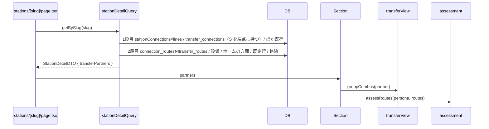

# 設計: 乗換難易度 Web 表示の対応 (Issue #125)

- **参照**: [requirements.md](./requirements.md) / [tasks.md](./tasks.md)

## アーキテクチャ

```
packages/transfer-difficulty/src/domain/
  requirement.ts     requirementFor / isBarrierFree（#124。変更なし）
  directionLabel.ts  resolveDirectionLabel（#130。変更なし）
  assessment.ts      【新規】lightestRequirement / assessRoutes / detourMinutes（重さの順序を使うのでここに置く）

apps/web/src/
  external/query/stationDetailQuery.ts   旧4列の読み取りを外し、transferPartners を組む
  external/query/transferPartnerRows.ts  【新規】新モデルの読み取り（2段の Promise.all）と DTO の組み立て
  features/station/domain/types.ts       TransferPartnerDTO ほか（TransferConnectionDTO を置き換え）
  features/station/domain/transferView.ts【新規】方面のグループ化・値が異なる項目の検出（純粋関数）
  components/TransferDifficultySection.tsx  書き換え（ペルソナ2列を維持）
  constants/transferDifficulty.ts        【新規】状態のアイコン・色、フラグの文言
  constants/difficulty.ts                【削除】読む箇所が無くなる
```

## データフロー


```mermaid
sequenceDiagram
  participant Page as stations/[slug]/page.tsx
  participant Q as stationDetailQuery
  participant DB
  Page->>Q: getBySlug(slug)
  Q->>DB: 1段目 stationConnections×lines / transfer_connections（S を端点に持つ）/ ほか既存
  Q->>DB: 2段目 connection_routes⋈transfer_routes / 設備 / ホームの方面 / 既定行 / 路線
  Q-->>Page: StationDetailDTO { transferPartners }
  Page->>Section: partners
  Section->>transferView: groupCombos(partner)
  Section->>assessment: assessRoutes(persona, routes)
```

## インターフェース

### パッケージ（`assessment.ts`）

```ts
export type RouteFacts = { minutes: number | null; isBaseline: boolean; facilities: readonly FacilityTypeCode[] };

export function lightestRequirement(persona: Persona, requirements: readonly (Requirement | null)[]): Requirement | null;

export type Assessment<R extends RouteFacts> =
  | { kind: 'unevaluated' }
  | { kind: 'barrierFree'; routes: R[] }
  | { kind: 'undetermined'; lightest: Requirement | null }
  | { kind: 'none'; lightest: Requirement | null };

export function assessRoutes<R extends RouteFacts>(persona: Persona, routes: readonly R[]): Assessment<R>;
export function detourMinutes(persona: Persona, routes: readonly RouteFacts[]): number | null;
```

### DTO（`features/station/domain/types.ts`）

```ts
export type TransferRouteDTO = {
  routeId: string; label: string; isBaseline: boolean; minutes: number | null;
  isOutdoor: boolean; requiresExitGate: boolean; requiresStaff: boolean; isOfficiallyGuided: boolean;
  notes: string | null; facilities: FacilityTypeCode[];
};
export type TransferComboDTO = {
  stationDirection: DirectionType; connectedDirection: DirectionType;
  notes: string | null; routes: TransferRouteDTO[];
};
export type TransferPartnerDTO = {
  connectedStationId: string; lineName: string; lineColor: string | null;
  stationLineName: string;
  directionLabels: { station: Record<DirectionType, string>; connected: Record<DirectionType, string> };
  combos: TransferComboDTO[];   // 接続行がある組み合わせだけ。空 = 未評価
};
```

### 表示の組み立て（`transferView.ts`）

```ts
export type ComboGroup = {
  heading: string | null;          // すべての組み合わせが同じなら null
  combos: TransferComboDTO[];      // 空 = 未評価のグループ
  routes: TransferRouteDTO[]; notes: string | null;
};
export function groupCombos(partner: TransferPartnerDTO): ComboGroup[];
export type RouteField = 'minutes' | 'requirement' | 'isOutdoor' | 'requiresExitGate' | 'requiresStaff' | 'isOfficiallyGuided';
export function differingFields(persona: Persona, routes: readonly TransferRouteDTO[]): Set<RouteField>;
```

## 決定

### 決定1: 重さの順序を使う関数はパッケージに置く
`requirement.ts` の WEIGHT は「この関数の中だけに存在する」規約。最も軽い行為（REQ-7）は順序が要るため、Web に書かず
パッケージに足す。状態の分類・迂回度も解釈規則なので同じ場所に置く（Admin のプレビューが将来使える）。

### 決定2: 「確認できていない」状態を足す
ADR-0012 は、設備0件のルートを導出にもバリアフリールートの数にも入れないと決めている。
その結果、バリアフリールートが0本でも、未入力のルートがバリアフリーである可能性は残る。この状態を「なし」と
断定すると事実と違うことがあるため、別の状態にする（開発者判断 2026-09-27）。恒久ルールとして domain に書く。ADR は作らない
（ADR-0012 の帰結であり、独立した設計判断ではないため）。

### 決定3: 方面のグループ化は「ルートの組＋接続の備考」の一致で行う
組み合わせごとに routeId・label・isBaseline の組と接続の備考が一致するものを1グループにまとめる。
見出しは次のように決める。
- グループが S 側の方面1つだけで決まる場合（T の両方面を含む）→「{S の路線} {S の方面}」
- T 側の方面1つだけで決まる場合 →「{T の路線} {T の方面}」
- それ以外 → 組み合わせごとに「{S の方面} → {T の方面}」を「、」で連結する

評価済みの組み合わせが4通りそろわない場合、残りの組み合わせは「未評価」のグループにする。
全組み合わせが1グループなら見出しは null になる（現行と同じ1枚の見た目）。

### 決定4: 方面ラベルは駅の最初の路線で解決する
`docs/domain/line-directions.md` のとおり、駅は1駅1路線である。Admin の駅対編集画面と同じく、`stationLines` を路線の
`displayOrder`、同順なら id で並べた先頭の路線で、ホームと既定行を絞る。ホームは番号の数値順に渡す。

### 決定5: `PlatformTabs` とは統合しない
ホームのタブは `line_directions.id` 単位で、乗換接続は `(駅, direction_type)` 単位。キーが違ううえに、ホームが
登録されている駅は20駅だけである。乗換セクションの中で方面の見出しを出す。

### 決定6: `constants/difficulty.ts` はこのデプロイで消す
Web で読む箇所が無くなり、DB にも触れないため。旧4列と enum の削除は、列を読むコードが本番から消えたあとの次のデプロイで行う
（CLAUDE.md の二段階ルール）。

### 決定7: 「公式案内なし」を表示する
移行データの `isOfficiallyGuided = false` は確認済みの値（開発者確認 2026-09-28）。false のルートに
「駅の構内図・公式案内に載っていないルート」と表示する。

## エラーハンドリング

| 状況 | 応答 |
|---|---|
| 設備コードが `FACILITY_TYPE_CODES` に無い | その行を捨てる（Admin の `isFacilityCode` と同じ） |
| 紐付けの先のルートが見つからない | その紐付けを捨てる |
| 相手駅の路線が引けない | 既存どおり、inner join で相手駅ごと出ない |
| 方面の文言が無い | `resolveDirectionLabel` の ③（上り/下り） |
| DB エラー | 既存どおり、ページの error boundary に任せる |

## テスト戦略

- パッケージ（vitest）: `lightestRequirement` はペルソナごとの順序・impossible と null の除外、`assessRoutes` は4状態＋未入力の混在、
  並べ替え（null を末尾に）、`detourMinutes` は値が欠けたとき・基準ルートがバリアフリーのとき
- Web domain（vitest）: `groupCombos`（全共通・淡路町↔小川町型・未評価の混在・単一の組み合わせ）、`differingFields`
- コンポーネント（testing-library）: 設備0件のルートが「そのまま通れる」と出ないこと、各状態の文言、方面の見出し
- クエリ: CI に DB が無いため、development での手動確認で押さえる

## 恒久知識の振り分け（フェーズ5で反映）

| 内容 | 置き場 |
|---|---|
| 表示の状態の分類（「確認できていない」を含む）・並べ替え・迂回度の定義 | `docs/domain/station-master-model.md`「乗換難易度」 |
| 方面のグループ化の規則 | 同上 |
| Web が方面ラベルを表示する（適用状況の注記を外す） | `docs/domain/line-directions.md` |
| ADR-0012 の Accepted 化 | `docs/adr/0012-*.md` |
| 旧4列の削除 | GitHub Issue（予定された作業） |
